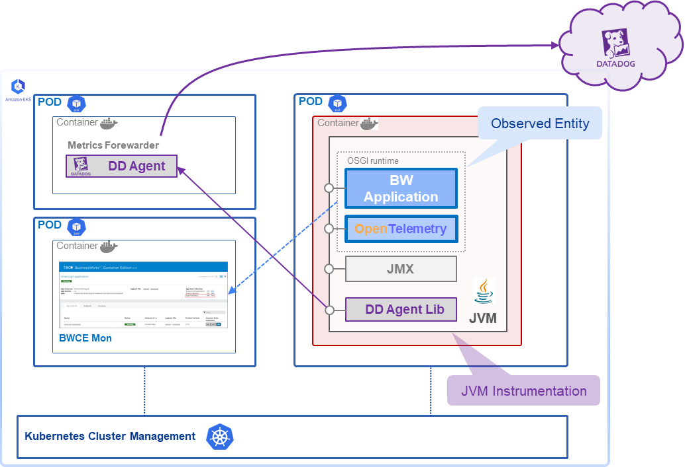
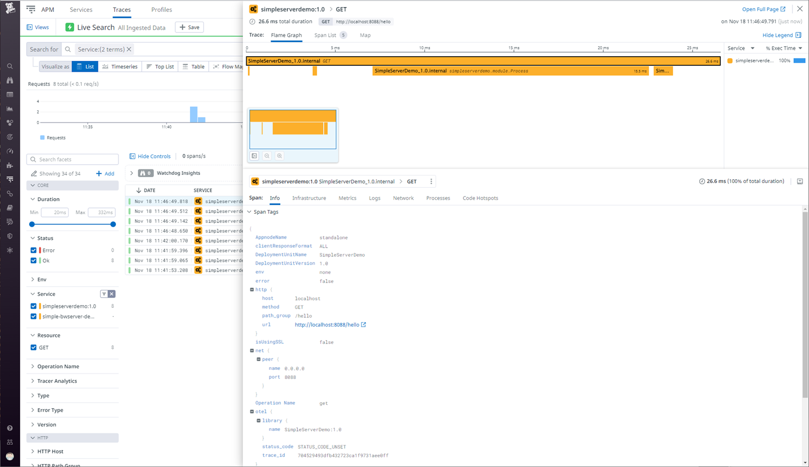

*This is a draft version of my article for publishing on [Medium.com](https://medium.com):*

# Do you have an Observability Strategy for your Integration Applications?

*OR* - How can I monitor my integration application?

*Profiling and Tracing*, *Monitoring and Alerting* as well as *Exception Tracking* or *Tracing* of individual calls on their way through a bunch of microservices (in a mesh) are becoming more important than ever if a company decided to move all IT resources to the cloud. What *Cloud* means in that context can be quite different. Often it's a synonym for a virtual private cloud ([VPC](https://en.wikipedia.org/wiki/Virtual_private_cloud)) hosted at one of the hyper scalers like AWS, Azure, GCP or infrastructure providers like Linode, Hetzner to just name a view. In other context the strategy behind a move to cloud initiative is much broader. Often enterprises do have a need to support a range of different infrastructure or cloud service providers. And that's the tricky part, as one cannot rely on any pre-built monitoring, alerting and tracing features provided by an individual vendor. Therefore, specialized providers emerged to solve the problem with another cloud SaaS offering.

Recently the developers of a customer approached us with the question how to enable applications running on our specialized integration application server for supervision of such a cloud monitoring provider. More specific, the question was how to add a library provided by their cloud monitoring vendor to include the integration services into the same centralized monitoring infrastructure. The expectation of the DevOps seemed to be that adding the library would already solve their monitoring problem. That’s where I started to explore things.

<u>*Full disclosure:*</u> *I'm working for [Cloud Software Group](https://www.cloud.com/), a newly formed software vendor integrating [TIBCO](https://www.tibco.com/) and [Citrix](https://www.citrix.com/) as sales engineer. The integration server in question here is [TIBCO BusinessWorks Container Edition](https://www.tibco.com/resources/datasheet/tibco-businessworks-container-edition). But the story and considerations do apply to other solutions in the integration space as well.*

## What are monitoring and tracing?

One can find quite different definitions on the web on what monitoring, profiling and tracing are. What is needed in our case is insight on some KPIs of a running integration application to get early warnings if certain parts of an integration are not working normal or problems of a 3rd party service start causing our service to become instable or unresponsive. For that we need to collect metrics data from our application that show relevant measures. That is known as Application Performance Management ([Wikipedia APM](https://en.wikipedia.org/wiki/Application_performance_management)).

For distributed systems with multiple layers and microservice based applications tracing service calls end-to-end becomes more important to understand root causes for degraded system performance even if individual services are still operating normal. A nice intro on the topic might be [Distributed tracing vs. application monitoring](https://www.sumologic.com/blog/distributed-tracing-vs-application-monitoring/). The W3C already recognized that and published a recommendation on how to enable distributed tracing: [W3C Trace Context](https://www.w3.org/TR/trace-context/).

So, in context of integration applications we are focusing on, it is important to understand the flow of requests/messages (the data exchange) between systems. So both, APM and distributed tracing are required by ops teams.

## What are the requirements behind the original question?

The original questions were: how add Datadog monitoring to our BWCE applications? As we don't have an official partnership with a specific vendor in that space, the docs do not provide instructions on how to use 3rd party solution with TIBCO's integration solution BWCE. To support our customer, we did some research on the 3rd party solution and integrations it might offer to find a way to integrate the two.

## What options do we have?

The integration server BWCE comes with several built-in solutions for metrics collection and using it for monitoring and alerting. Our product comes with built-in metrics collection and distribution for any relevant details potentially required by usual integration flows. For that it includes a number of actions and measures instrumented in the code. From the history those measures were made for the TIBCO monitoring solution. Hence, all these measures are built-in the application runtime engine and any plugins available for it. That is typically the best option, because the designers of the system have thought about the internal workings and relevant measures that can be used to monitor applications on their KPIs. If those details are available via an open format or protocol a third-party system would be able to ingest them.

Another option of many observability solutions is the instrumentation of the executable code in way that is providing measures to form KPIs from. This option is often used by monitoring and alerting solutions for any kind of program execution engines that work either on byte-code level (e.g. Java, C#) or with language interpreters (e.g. Python, JavaScript). For both options the executed code is change/enhance with additional code on programming language standard classes to add measures or even inject code that changes handling of a network protocol - like injecting http headers to allow for distributed tracing.

It looked like the solution idea our customer is falling into the second category. The approach would allow to cover all kinds of enterprise applications for any programming language the monitoring solution vendor provides support for.

## Solutions

TIBCO BWCE is proven integration application server available for many years now and widely adopted by major companies around the world. It is a Java based application server. Therefore, its underlying JVM can be instrumented on that level. We only had one difficulty, since BWCE the application server is not installed and run as a dedicated infrastructure. Instead, its now package of a application and the execution engine as one docker container image as distribution unit. The container build procedure must be adopted to allow the instrumentation and integration with a 3rd party solution.

### Instrumenting a JVM

Instrumentation for APM or profiling works differently for execution environments. A compiled C/C++ or Go application needs a different approach than a programming language like Java or C# with their byte code interpreter engine or Python and JavaScript with their language interpreters.

In our case we have a Java based enterprise application server that is relaying on the Java Virtual Machine (JVM). The JVM already comes with built-in capabilities to instrument byte code in a way to collect metrics data or even slightly adopt the behavior of some classes to add functionalities needed for tracking. The adoption part is becoming relevant for things like adding distributed tracing for microservices that are typically called as part of a much larger transaction. At [Baeldung.com](https://www.baeldung.com) there is a nice article explaining the [Guide to Java Instrumentation](https://www.baeldung.com/java-instrumentationumentation).

In short, the JVM allows to dynamically load code archives and libraries. To allow instrumentation of the application code an appropriate instrumentation library must be loaded first be the JVM in order to apply its changes on the application code that is loaded and execurted by this JVM process. For this the JVM defines a strict sequence how instrumentations need to be provided. Sample: `java -javaagent:agent.jar -jar application.jar` More details can be found at the Java Docs [Package java.lang.instrument](https://docs.oracle.com/en/java/javase/14/docs/api/java.instrument/java/lang/instrument/package-summary.html).

Why is all that important? Because, we need to tweak the startup of our JVM process to enable the instrumentation. That is obvious for a Java program started locally. But in case a vendor has provided complex startup logic or the application is packaged as a container might require a closer look on how to provide the instrumentation.

### How does it work in Container Land?

Docker containers are the way applications are packed and run today. Often container orchestration system like [Kubernetes](https://kubernetes.io/) are used. As applications are already *packaged* as containers either by a vendor or as result of a CI/CD pipeline adding an instrumentation requires a change of the packaging process in a way that the resulting application container image includes the required additional instrumentation code and its parametrization.

If the creator of the container image has not considered instrumentation, the creation process needs to be adopted. That was the case for us with [TIBCO BusinessWorks Container Edition v2.7.x](). There is a described [BWCE - Application Development for Docker](https://docs.tibco.com/pub/bwce/2.8.0/doc/html/Default.htm#app-dev-guide/application-developm3.htm) which is considering custom enhancements of an integration application by adding additional BusinessWorks plugins or custom code as additional JARs. Up to now, the product is not considering instrumentation like the way provided by Datadog. For details see how Datadog can instrument a JVM see the docs [Tracing Java Applications](https://docs.datadoghq.com/tracing/trace_collection/dd_libraries/java/?tab=containers).

*The details on how to adopt the application server in question - [TIBCO BusinessWorks Container Edition](https://docs.tibco.com/products/tibco-activematrix-businessworks) - please refer to the sample provided as a patch available at [Github Repo: Simple TIBCO BWCE Service with Datadog integration](https://github.com/rkiesi/simple-bwserver-for-dd).*

Overall environment for a BWCE integration application on Kubernetes. 

### OMG, we get so many details!

Now that we have adopted our container application build process to consider a 3rd party instrumentation we can start our application. Our customer likes to use the Datadog cloud-based system monitoring and application performance monitoring. So, we can now start the stuff and see what we get. Out of the box that approach seemed to be far to detailed. As the instrumentation was not told what parts (classes) of the application will produce relevant KPIs it was instrumenting each and every loaded class for profiling. That produced to many unnecessary details!

We need a way to restrict the instrumentation process to only getting relevant and meaningful measures. One way would be to understand the inner workings and design of the integration engine and the application it is running to only receive metrics from the relevant functions. If the vendor isn't supporting it, this task will be tedious and error prone. Another downside is that all configurations potentially need to be redone and verified for each new release of the vendor system.

### OpenTelemtry is already built in!

In the last years OpenTelemetry evolved a common standard in the field of distributed tracing as a successor of several other projects. The initiative standardizes metrics formats and representations. Many tools have now built in support for ingesting and using those metrics data. TIBCO also built [OpenTelemtry](https://opentelemetry.io/) (OTLP) support into its application server engine BWCE. TIBCO BWCE is packaged and delivered with the OTLP Java libraries. The BWCE engine and TIBCO provided BW plugin code is already instrumented for emitting meaningful application metrics - [TIBCO BusinessWorks Container Edition 2.8.0 - OpenTelemetry](https://docs.tibco.com/pub/bwce/2.8.0/doc/html/Default.htm#bwce-app-monitoring/opentracing.htm) and BWCE pre-defined tags supported: [OpenTelemetry Tags From Palettes](https://docs.tibco.com/pub/bwce/2.8.0/doc/html/Default.htm#bwce-app-monitoring/opentracing-tags-fro.htm).

Tracing service calls via cloud monitoring solution using OTLP metrics give a much more precise picture on what is relevant and going on within the simple REST service test application.

### Distributed Tracing and Jaeger

Another requirement than just getting insight into the call graph and KPIs of a single application is to follow or trace a transaction through a sequence of microservices, a service mesh. That is known as distributed transaction monitoring - see articles referenced below. It's a tooling to trace and follow the handling of integration or service requests to understand problems or even get notified if importantd metrics reveal bottlenecks on some dependent (micro)services or important resources even before the users will experience issues.

One of the most know tools developed for that purpose is [Jaeger](https://www.jaegertracing.io/), a [CNCF](https://www.cncf.io/) project. It started with its own instrumentation and telemetry definitions, but has now switched to OLTP as well. As BWCE is supporting OLTP support for distributed tracing will be added soon as well. There was no agreed standard before, but with the *W3C Recommendation for Distributed Tracing* (see links below) a harmonization between the tools and instrumentations has evolved now.

The implementation sample at *[GitHub Repo: Simple TIBCO BWCE Service with Datadog integration](https://github.com/rkiesi/simple-bwserver-for-dd)*  provides details on how to configure BWCE for using Jaeger.

### The built-in Performance Tracing Solution

TIBCO BWCE is a special edition of TIBCO BusinessWorks v6 which enables BW for the container world. The stand-alone tooling was always provided with extensive management and monitoring capabilities. For BWCE the application management aspect changes, as many of the functions are now part of the responsibility of the container orchestration. But a system like Kubernetes doesn't provide a metrics monitoring out of the box. To cover the functionality BWCE comes bundled with a simple to use monitoring solution: [BWCEMon - Application Monitoring](https://docs.tibco.com/pub/bwce/2.8.0/doc/html/Default.htm#bwce-app-monitoring/application-monitori.htm). This tool is using similar KPIs than the metrics generated for OLTP. But it provides already dashboards that are purpose built for TIBCO BWCE monitoring. As this tool is better suited for the integration developer its worth to consider it in addition to monitoring components that focus more on the infrastructure and resource monitoring.

# Conclusion

Most often a combination of infrastructure monitoring and more specific application performance monitoring (APM) are the elements needed. As a systems engineer don't just jump on the requirement and start solving it with what looks like a quick solution. Instead, it is important to ask the *question behind the question* to understand why a feature or requirement was raised. Then ask yourself "Is it the right thing?". As the investigation and tests above showed, often there will several options and different personas might have different needs. Revealing requirements of all involved personas will provide the full picture. By investing a bit more time to understand the requirements a better solution could be designed. So, it was worth to ask the question behind the (technical) requirement. That is the responsibility of the IT architect.

## Bibliography

* Article [Distributed tracing: A Complete Guide](https://lightstep.com/distributed-tracing), last visited on 11/25/2022
* Article [Distributed tracing vs. application monitoring](https://www.sumologic.com/blog/distributed-tracing-vs-application-monitoring/), last visited on 11/24/2022
* Article on Baeldng: [Guide to Java Instrumentation](https://www.baeldung.com/java-instrumentationumentation), last visited on 11/24/2022
* Java Docs [Package java.lang.instrument](https://docs.oracle.com/en/java/javase/14/docs/api/java.instrument/java/lang/instrument/package-summary.html), last visited on 11/24/2022
* Distributed Tracing W3C Recommandation [W3C Trace Context](https://www.w3.org/TR/trace-context/), last visited on 11/25/2022
* Article on Aspecto [What is OpenTelemetry? A Straightforward Guide](https://www.aspecto.io/blog/what-is-opentelemetry-the-infinitive-guide/?utm_source=jaeger-medium&utm_medium=post&utm_campaign=jaeger-tracing-the-ultimate-guide), last visited on 11/28/2022
* Article on Medium [Jaeger Tracing: A Friendly Guide for Beginners](https://medium.com/jaegertracing/jaeger-tracing-a-friendly-guide-for-beginners-7b53a4a568ca), last visited on 11/28/2022