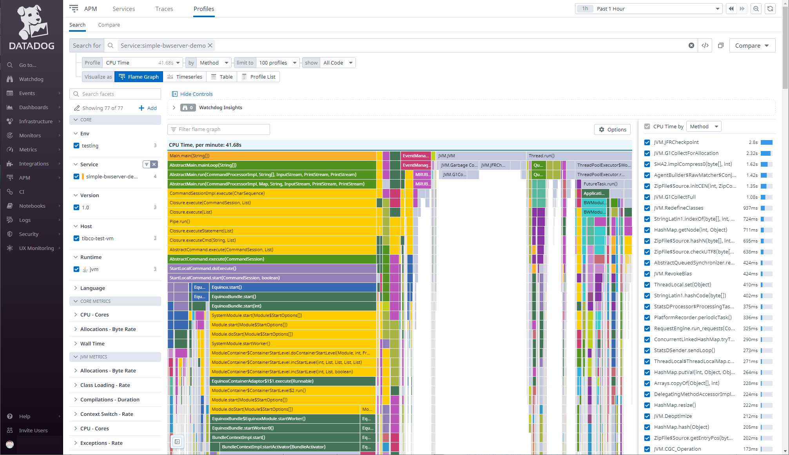

This is a draft version of my article for publishing on [Medium.com](https://medium.com):

# How can I monitor my integration application OR do you have an observability strategy?

*Profiling and Tracing*, *Monitoring and Alerting* as well as *Exception Tracking* or *Tracing* of individual calls on their way through a bunch of microservices (in a mesh) are becoming more important then ever if a company decideds to move all IT resources to the cloud. What *Cloud* means in that context can be quite different. Often its a synonym for a virtual private cloud ([VPC](https://en.wikipedia.org/wiki/Virtual_private_cloud)) hosted at one of the hyper scalers like AWS, Azure, GCP or infrastructure providers like Linode, Hetzner to just name a view. In other context the strategy behind a move to cloud initiative is much broader. Often enterprises do have a need to support a range of different infrastructure or cloud service providers. And that's the tricky part, as one cannot rely on any pre-built monitoring, alerting and tracing features provided by an individual vendor. Therefore specialized providers emerged to solve the problem with another cloud SaaS offering.

Recently the developers of a customer approached us with the question how to enable applications running on our specialized integration application server for supervision of such a cloud monitoring provider. More specific, the question was how to add a library provided by their cloud monitoring vendor to include the integration services into the same centralized monitoring infrastructure. The expectation of the DevOps seemed to be that adding the library would already solve their monitoring problem. Here is where I started to explore things.

<u>*Full disclosure:*</u> *I'm working for [Cloud Software Group](https://www.cloud.com/), a newly formed software vendor integrating [TIBCO](https://www.tibco.com/) and [Citrix](https://www.citrix.com/) as sales engineer. The integration server in question here is [TIBCO BusinessWorks Container Edition](https://www.tibco.com/resources/datasheet/tibco-businessworks-container-edition). But the story and considerations do apply to other solutions in the integration space as well.*

## What are monitoring and tracing?

One can find quite different definitions on the web on what minitoring, profiling and tracing are. What is needed in our case is insight on some KPIs of a running integration application to get early warnings if certain parts of an integration are not working normal or problems of a 3rd party service start causing our service to become instable or unresponsive. For that we need to collect metrics data from our application that show relevant mesasures. That is known as Application Performance Management ([Wikipedia APM](https://en.wikipedia.org/wiki/Application_performance_management)).

For distributed systems with multiple layers and microservice based applications tracing service calls end-to-end becomes more important to understand root causes for degraded system performance even if individual services are still operating normal. A nice intro on the topic might be [Distributed tracing vs. application monitoring](https://www.sumologic.com/blog/distributed-tracing-vs-application-monitoring/). The W3C already recognized that and published a recommandation on how to enable distributed tracing: [W3C Trace Context](https://www.w3.org/TR/trace-context/).

So, in context of integration applications we are focusing on, it is important to understand the flow of requests/messages (the data exchange) between systems. So both, APM and distributed tracing are required by ops teams.

## What is really needed by raising the requirement?

## What options do we have?

solution already built into product
solution by adding 3rd party code and instrument
solution by vendor - propriatory but integrated

## Solutions

..app server runs on a JVM
..proven solution since many years
..orginally not made for containers, but reacently extendended for the container world

### Instrumenting a JVM

Instrumentation for APM or profiling works differently for execution environments. A compiled C/C++ or Go application needs a differnt approach than a programming langage like Java or C# with their byte code interpreter engine or Python and Javascript with their language interpreters.

In our case we have a Java based enterprise application server that is relaying on the Java Virtual Mashine (JVM). The JVM already comes with built-in capabilities to instrument byte code in a way to collect metrics data or even slightly adopt the behaviour of some classes to add functionalities needed for tracking. The adoption part is becoming relevant for things like adding distributed tracing for microservices that are typically called as part of a much larger transaction. At [Baeldung.com](https://www.baeldung.com) there is a nice article explaining the [Guide to Java Instrumentation](https://www.baeldung.com/java-instrumentationumentation).

In short, the JVM allows to dynamically load code archives and libraries. To allow instrumentation of the application code an appropriate instrumentation library must be loaded first be the JVM in order to apply its changes on the application code that is loaded and execurted by this JVM process. For this the JVM defines a strict sequence how instrumentations need to be provided. Sample: `java -javaagent:agent.jar -jar application.jar` More details can be found at the Java Docs [Package java.lang.instrument](https://docs.oracle.com/en/java/javase/14/docs/api/java.instrument/java/lang/instrument/package-summary.html).

Why is all that important? Because, we need to tweak the startup of our JVM process to enable the instrumentation. That is obvious for a Java program started locally. But in case a vendor has provided complex startup logic or the application is packaged as a container might require a closer look on how to provide the instrumenmtation.

### How does it work in container land?

Docker containers are the way applications are packed and run today. Often container orchestration system like [Kubernetes](https://kubernetes.io/) are used. As applications are already *packaged* as containers either by a vendor or as result of a CI/CD pipeline adding an instrumentation requires a change of the packaging process in a way that the resulting application container image includes the required additional instrumenation code and its parametrization.

If the creator of the container image has not considered instrumentation, the creation process needs to be adopted. That was the case for us with [TIBCO BusinessWorks Container Edition v2.7.x](). There is a [descibed BWCE build process]() which is considering custom enhancements of an integration application by adding additional BusinessWorks plugins or custom code as additional JARs, but adding an instrumentation agent like the one provided by Datadog was not considered. For details see the Datadog docs [Tracing Java Applications](https://docs.datadoghq.com/tracing/trace_collection/dd_libraries/java/?tab=containers).

*The details on how to adopt the application server in question - [TIBCO BusinessWorks Container Edition](https://docs.tibco.com/products/tibco-activematrix-businessworks) - please refer to the sample provided as a patch available at [Github Repo: Simple BW Service with Datadog integration](https://github.com/rkiesi/simple-bwserver-for-dd).*

Overall environemnt for a BWCE integartion application on Kubernetes. 

### OMG, we get so many details!

Now that we have adopted our container application build process to consider a 3rd party instrumentation we can start our application. Our customer likes to use the Datadog cloud-based system monitoring and application performance monitoring. So we now can start the stuff and see what we get. Out of the box that approach seemed to be far to detailed. As the instrumentation was not told what parts (classes) of the application will produce relavant KPIs it was instrumenting each and every loaded class for profiling. That produced to many unessesary details!

We need a way to restrict the instrumentation process to only getting relevant and meaningful measures.

### OpenTelemtry is already built in!

..OpenTelemtry was built into the application server [TIBCO BusinessWorks Container Edition]() already..
  ..BW engine and TIBCO provided plugin code is already instrumented for emitting meaningful application metrics
..shows metrics relevant to the business oriented developer

#### Jaeger: Tracing calls trough a Mervice Mesh

..tooling to trace / follow handling of integration requests to understand problems or even get notified if importantd metrics reveal bottlenecks on some dependend microservices or important resources

#### Tracing calls via Cloud Monotoring Solution

..same is available on a central place, nice!

### Performance Tracing is already built-in!

..integration application server already comes with a monitoring and call tracing component.
..better suited for the integration developer as it shows metrics on the same level as the developer tooling is using it

# Conclusion

Most often a combination of infratructure monitoring and more specific application performance monitoring (APM) are the elements needed. As a systems engineer don't just jump on the requirement and start solving it with what looks like a quick solution. Instead, it is important to ask the *question behind the question* to understand why a feature or requirement was raised. Then ask yourself "Is it the right thing?". As the investigation and tests above showed, often there will several options and different personas might have different needs. Revealing requirements of all involved personas will provide the full picture. By investing a bit more time to understand the requirements a better solution could be designed. So it was worth to ask the question behind the (technical) requirement. That is the responsibility of the IT architect.

# Bibliography

* Article [Distributed tracing: A Complete Guide](https://lightstep.com/distributed-tracing), last visited on 11/25/2022
* Article [Distributed tracing vs. application monitoring](https://www.sumologic.com/blog/distributed-tracing-vs-application-monitoring/), last visited on 11/24/2022
* Article on Baeldng: [Guide to Java Instrumentation](https://www.baeldung.com/java-instrumentationumentation), last visited on 11/24/2022
* Java Docs [Package java.lang.instrument](https://docs.oracle.com/en/java/javase/14/docs/api/java.instrument/java/lang/instrument/package-summary.html), last visited on 11/24/2022
* Distributed Tracing W3C Recommandation [W3C Trace Context](https://www.w3.org/TR/trace-context/), last visited on 11/25/2022
